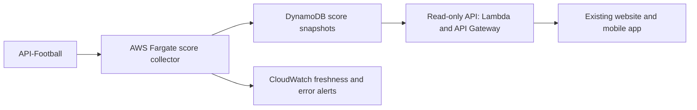

# Live-score architecture reset

Decision proposal, 26 September 2026. Scope: Premier League and Champions League.
Status: local design; no infrastructure provisioned, subscription changed or
production traffic moved. Supersedes further incremental feeder work as the
next major reliability investment.

## Recommendation

Build a dedicated score ingestion service on AWS, keep the existing website and
account/fantasy features, and recommend API-Football Ultra as the initial data
plan. The essential change is one controlled upstream collection path and a
separate stored-data read API. Moving the existing request-driven Worker logic
unchanged to AWS would preserve the failure modes.

Cloudflare Durable Objects could also coordinate collection and provide strong
consistency; Cloudflare itself is not inherently unsuitable. AWS is the preferred
trial because a persistent collector gives us explicit process health, restart
behaviour and an independently testable provider network path. AWS egress must
be proven against the provider before any production cutover; it is not assumed
to cure provider refusals.

## Evidence and limits

- Current code lets `getLive` and match-detail readers trigger provider work,
  sharing in-process pacing and per-location caches. Cron jobs and the separate
  GitHub feeder also use the same provider account. This does not enforce one
  account-wide request budget.
- The feeder is a chain of GitHub Actions jobs. Scheduled starts can be delayed
  or dropped under load according to [GitHub's documentation](https://docs.github.com/en/actions/reference/workflows-and-actions/events-that-trigger-workflows#schedule).
- The backup score copy uses Workers KV. Cloudflare documents propagation delays
  of 60 seconds or more between locations. This is a poor fit for the authoritative
  live score store; it is not proof KV caused every reported delay.
  [KV consistency](https://developers.cloudflare.com/kv/concepts/how-kv-works/).
- Read-only checks on 26 September around 13:39 UTC: `/health/quota` reported a
  daily allowance of 7,500, 7,492 remaining, and no active limit; minute allowance
  was unavailable. A PL request returned 200 in 0.462 seconds, with 380 fixtures
  and zero marked live; a CL request returned 502. This sample contradicts a
  claim that current daily exhaustion explains all failures. It does not prove
  the cause of the CL error or historical delays. Requests without the website's
  Origin header were refused and were not used to diagnose provider health.
- GitHub `main` and the latest listed workflow runs still use `07867e6` from
  14 September. The tested September 19 changes through `0554c6c` are local.
  Worker deployment identity was not independently rechecked in this assessment.
  Local test success has not established production recovery.

## Proposed flow

1. Run a small ECS/Fargate service in Ireland. Use a DynamoDB lease with a fencing
   generation so rolling deployments and failover cannot create competing writers.
   Every provider read, including supplementary and scheduled data, goes through
   the active collector's priority queue and account-wide budget. Inventory and
   redirect existing fantasy, notification, analysis and static-build readers
   before claiming this invariant is satisfied.
2. Poll supported live fixtures in batches approximately every 15 seconds while
   matches are active. Poll schedules more slowly outside match windows. Discover
   upcoming fixtures continuously; do not rely on a GitHub start time or fixed
   evening shutdown. Provider-supported batching and permitted cadence must be
   verified in the trial. Score updates outrank detail and optional analysis.
3. Persist normalized, versioned snapshots. Preserve last-good values on errors,
   allow genuine provider score corrections, and reject writes from expired lease
   holders. Track provider-observed time, successful fetch time and publication
   time separately. Do not present a cached read timestamp as score freshness.
4. Keep hot records small, partitioned by competition/date or fixture. Store long
   season schedules separately. Publish a version manifest after its data so a
   reader cannot assemble a half-written update. Enforce item-size limits.
5. Read through a small Lambda/API Gateway endpoint using strongly consistent
   DynamoDB table reads where freshness matters; no cached global index as the
   authoritative read. Client reads do not call API-Football. Retain existing
   response contracts or add a compatibility adapter for the existing app.
6. Begin with short client polling rather than adding streaming infrastructure
   immediately. Polling frequency, API cost and mobile battery use are separate
   from provider demand. Add push delivery only if measured experience warrants it.
7. Measure collector heartbeat, source age, publication age, provider latency,
   refusals and request budget. Alert on a stalled collector or stale active
   matches even when HTTP responses remain 200. Retain clearly labelled last-good
   scores during outages.

ECS can replace failed service tasks; that is not instantaneous failover. Prove
recovery time and consider a passive task under the same lease if one-task
recovery misses the target. DynamoDB strongly consistent table reads are an
explicit choice, not its default.
[ECS service behaviour](https://docs.aws.amazon.com/AmazonECS/latest/APIReference/API_CreateService.html),
[DynamoDB read consistency](https://docs.aws.amazon.com/amazondynamodb/latest/developerguide/HowItWorks.ReadConsistency.html).

## API plan and request budget

Published direct-subscription prices checked on 26 September:

| Plan | Monthly list price | Daily allowance | Per-minute allowance |
| --- | ---: | ---: | ---: |
| Pro | $19 | 7,500 | 300 |
| Ultra | $29 | 75,000 | 450 |
| Mega | $39 | 150,000 | 900 |

[Prices](https://www.api-football.com/pricing),
[published rate limits](https://www.api-football.com/news/post/how-to-optimize-api-sports-calls-and-quota-usage).
The reported account allowance matches Pro, but checkout price, tax, prepaid
term and upgrade credit require confirmation in the actual account.

Recommend Ultra, not an automatic jump to Mega. It offers ten times the daily
allowance for a $10 monthly list-price difference from Pro. Its minute limit is
only 1.5 times Pro's: a larger plan does not remove the need for global pacing.
Plans buy request volume, not proof of faster source reporting. If API-Football
reports events too late even through the new collector, evaluate a different
data provider using a measured match sample.

Illustrative request budget, not a traffic forecast: two competition requests
every 15 seconds for eleven active hours cost 5,280 reads. Twenty matches with
two detail endpoints refreshed each minute for two hours add 4,800. That is
10,080 before schedules, lineups, standings and retries. Batching can reduce
this; fewer live hours reduce it; other consumers increase it. This explains
the Ultra recommendation without attributing the current outage to daily quota.

For AWS, reserve a provisional $50–100/month planning allowance at low traffic,
separate from the data subscription. This is not an Ireland-region quote or a
hard billing cap. Price compute, public networking, DynamoDB, API Gateway,
Lambda, logs, secrets and transfer with explicit read-volume assumptions before
provisioning. Avoid Kubernetes and an always-on load balancer for the first
collector. A public outbound-only task avoids a NAT gateway but does not provide
a stable allowlisted IP; stable egress, if required, needs a separately priced
design. Billing alerts warn; they do not cap spend.
[Fargate pricing](https://aws.amazon.com/fargate/pricing/),
[networking pricing](https://aws.amazon.com/vpc/pricing/).

## Validation and cutover gates

- Replay normal play, halftime, extra time, penalties, midnight, cancellations,
  score corrections, empty/malformed responses, 429s and stalled bodies locally.
- Inject collector failure, lease expiry and two simultaneous instances. Prove
  one permitted writer and no duplicate upstream burst during failover.
- Compare one client against a load test of 1,000 simulated readers. Provider
  request volume must stay determined by the collection plan, not reader count.
- Proposed target: p95 under 30 seconds from a change first observable from the
  provider to visibility in the app; separately measure event-to-provider delay.
  Target p95 read latency below 500 ms from the expected audience region and a
  visible stale indicator when the last successful live observation exceeds
  45 seconds. These are acceptance targets, not current measurements or guarantees.
- After explicit infrastructure approval, run the AWS collector beside the old
  path for at least two representative match windows, including a crowded CL
  window. Budget shadow reads centrally; do not silently double API demand.
  Compare values and times with current app output and headless competitor reads.
- Prepare an explicit release/rollback plan. After public deployment approval,
  cut over a limited audience, verify runtime behaviour, then retire obsolete
  provider reads and the GitHub feeder. Rollback must not activate two unbudgeted
  collectors. Preserve accounts, fantasy scoring, follows and notifications.

## Next authorized work

Implement the provider-neutral collector, snapshot contract, replay harness and
read adapter locally; prepare infrastructure as code and a priced AWS plan.
Infrastructure creation, actual API subscription changes and public cutover are
separate approval gates. The user's willingness to spend establishes a direction,
not an unspecified recurring bill. Pause lower-priority feeder refinements while
this replacement is developed.
